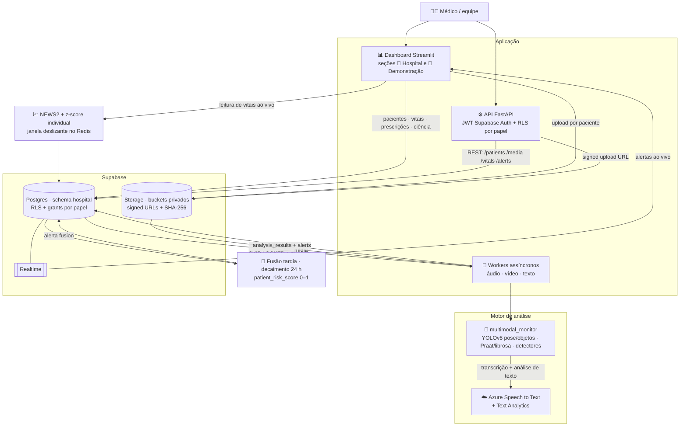
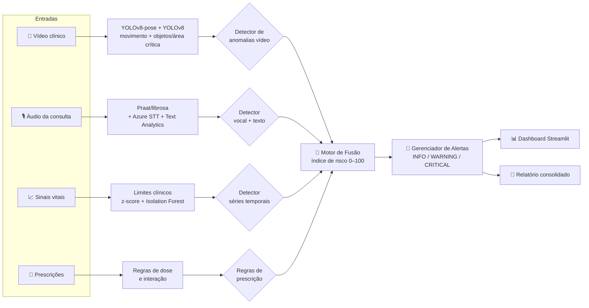
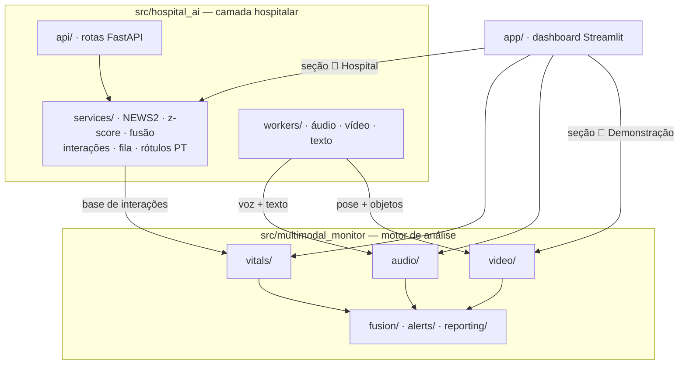

# 🏥 Monitoramento Multimodal de Pacientes

**Tech Challenge — FIAP Pós-Tech IA para Devs (8IADT) — Fase 4**

Sistema hospitalar de monitoramento contínuo de pacientes por dados **multimodais** — vídeo, áudio e séries temporais — que detecta sinais precoces de risco, funde os achados em um índice único e gera **alertas automáticos** para a equipe médica, com integração a **serviços gerenciados em nuvem (Azure Cognitive Services)**. Inclui uma **camada de gestão hospitalar** (Supabase): cadastro de pacientes e profissionais, upload multimodal por paciente, NEWS2 + baseline individual, histórico clínico e alertas em tempo real.

> Projeto acadêmico. Todos os dados são públicos (PhysioNet) ou simulados; **nenhum dado real de paciente** é utilizado e as detecções **não constituem diagnóstico médico**.

---

## 📑 Índice

- [O que o sistema faz](#-o-que-o-sistema-faz)
- [Arquitetura e fluxo multimodal](#-arquitetura-e-fluxo-multimodal)
- [Estrutura do repositório](#-estrutura-do-repositório)
- [Pré-requisitos](#-pré-requisitos)
- [Instalação (macOS e Windows)](#-instalação-macos-e-windows)
- [Configuração do Azure (tier gratuito F0)](#-configuração-do-azure-tier-gratuito-f0)
- [Preparação dos dados de exemplo](#-preparação-dos-dados-de-exemplo)
- [Como executar](#-como-executar)
- [Camada hospitalar (Supabase)](#-camada-hospitalar-pacientes-uploads-e-histórico--supabase)
- [Detalhe dos módulos e modelos](#-detalhe-dos-módulos-e-modelos)
- [Testes](#-testes)
- [Entregáveis](#-entregáveis)
- [Solução de problemas](#-solução-de-problemas)
- [Licença](#-licença)

---

## 🎯 O que o sistema faz

| Modalidade | Pipeline | Tecnologias / modelos |
|---|---|---|
| 🎥 **Vídeo** | Pose corporal quadro a quadro → features de movimento (ângulos articulares, velocidade, simetria) → detecção de **queda**, **imobilidade**, **desvio postural** e **zona segura**; detecção de objetos → **área crítica** (zona restrita) e **objetos inesperados** na cena → vídeo anotado + relatório de eventos | **YOLOv8-pose**, **YOLOv8** (objetos), OpenCV |
| 🎙️ **Áudio** | Features acústicas (jitter, shimmer, HNR, pausas, taxa de fala) → score de **fadiga/disartria**; transcrição da consulta → **sentimento** + **termos clínicos críticos** | Praat (parselmouth), librosa, **Azure Speech to Text**, **Azure Text Analytics** |
| 📈 **Sinais vitais** | Séries temporais (FC, SpO₂, respiração, PA) → **limites clínicos** + **z-score móvel** + **Isolation Forest** → alertas em tempo real | wfdb (PhysioNet), scikit-learn |
| 💊 **Prescrições** | Evolução de doses e combinações → **variação abrupta**, **descontinuação** e **interações de risco** | pandas (regras clínicas) |
| 🔀 **Fusão** | Scores das modalidades → **índice de risco 0–100** do paciente → central de alertas e relatório | motor de risco próprio |
| 🗂️ **Gestão hospitalar** | Pacientes e profissionais (CRUD), upload multimodal por paciente → fila de workers → histórico de análises; vitais com **NEWS2** + **z-score individual**; alertas em tempo real | **Supabase** (Postgres/RLS, Storage, Auth, Realtime), FastAPI, Redis |

---

## 🧭 Arquitetura e fluxo multimodal

### Visão geral do sistema (camada hospitalar + motor de análise)



### Motor multimodal (usado pela seção de demonstração e pelos workers)



### Camadas do código (a camada hospitalar reutiliza o motor — sem duplicação)



---

## 📁 Estrutura do repositório

```
fiap-fase04/
├── README.md                     # este arquivo
├── LICENSE                       # licença MIT
├── pyproject.toml                # dependências (gerenciadas pelo uv, Python 3.12)
├── .env.example                  # modelo das chaves (Azure, Supabase, Redis)
├── .python-version               # fixa Python 3.12
├── src/multimodal_monitor/       # biblioteca de análise multimodal
│   ├── config.py                 # .env, caminhos e thresholds centralizados
│   ├── video/                    # pose, movimento, objetos/área crítica, anomalias, relatório
│   ├── audio/                    # features acústicas, Azure STT, Azure Text Analytics
│   ├── vitals/                   # loaders (PhysioNet/sintético), detectores, prescrições, simulador
│   ├── fusion/                   # índice de risco do paciente
│   ├── alerts/                   # gerenciador de alertas (INFO/WARNING/CRITICAL)
│   └── reporting/                # relatório consolidado automático
├── src/hospital_ai/              # camada hospitalar (Supabase)
│   ├── main.py                   # API FastAPI (13 endpoints, JWT Supabase Auth)
│   ├── api/                      # pacientes, mídia (signed URLs), vitais, alertas
│   ├── services/                 # NEWS2, z-score, fusão tardia, interações, fila
│   └── workers/                  # fila hospital.jobs → análises da multimodal_monitor
├── db/migrations/                # bootstrap SQL do Supabase do zero (0001→0005)
├── app/                          # dashboard Streamlit (2 seções)
│   ├── Home.py                   # roteador de navegação (ponto de entrada)
│   ├── monitor_ui.py             # funções compartilhadas (cacheadas) + rótulos PT
│   └── paginas/                  # Hospital: Visão Geral, Pacientes, Profissionais
│                                 # Demonstração: Pipeline, Vídeo, Áudio, Vitais, Alertas
├── scripts/
│   ├── download_data.py          # baixa/gera as amostras (vídeo + áudio)
│   ├── generate_audio_samples.py # gera áudios de consulta pt-BR (TTS)
│   ├── run_pipeline.py           # pipeline CLI ponta a ponta
│   ├── seed_hospital.py          # dados demo da camada hospitalar (deterioração)
│   └── smoke_azure.py            # teste de fumaça da integração Azure
├── data/samples/                 # amostras de vídeo, áudio e prescrições
├── tests/                        # 37 testes (detectores + NEWS2/z-score/fusão)
└── docs/                         # relatório técnico e roteiro do vídeo
```

---

## ✅ Pré-requisitos

- **[uv](https://docs.astral.sh/uv/)** — gerenciador de ambiente/dependências Python (instala o Python 3.12 automaticamente).
- **[ffmpeg](https://ffmpeg.org/)** — processamento de áudio/vídeo.
- **Git**.
- (Opcional, para o módulo de áudio completo) uma conta **Azure** com os recursos *Speech* e *Language* no tier gratuito.
- (Opcional, para a camada hospitalar) um projeto **Supabase** gratuito — bootstrap em [`db/migrations/`](db/README.md) — e, se quiser janela z-score compartilhada, um Redis (Upstash gratuito).

> O YOLOv8 (`ultralytics`) baixa os pesos (`yolov8n-pose.pt`, ~6 MB) automaticamente na primeira execução do módulo de vídeo. Roda em CPU; usa GPU/Apple Silicon (MPS) quando disponível.

---

## 💻 Instalação (macOS e Windows)

Clone o repositório:

```bash
git clone https://github.com/leoangelos/fase04-fiap-final.git
cd fiap-fase04
```

### 🍎 macOS

```bash
# 1. uv e ffmpeg (via Homebrew)
brew install uv ffmpeg

# 2. cria o ambiente com Python 3.12 e instala tudo
uv sync

# 3. configura as chaves Azure (opcional — ver seção Azure)
cp .env.example .env
```

### 🪟 Windows (PowerShell)

```powershell
# 1. uv
powershell -ExecutionPolicy ByPass -c "irm https://astral.sh/uv/install.ps1 | iex"
# (ou: winget install --id=astral-sh.uv -e)

# 2. ffmpeg
winget install --id=Gyan.FFmpeg -e
#   (ou, com Chocolatey:  choco install ffmpeg)

# 3. cria o ambiente com Python 3.12 e instala tudo
uv sync

# 4. configura as chaves Azure (opcional — ver seção Azure)
copy .env.example .env
```

> Feche e reabra o terminal após instalar `uv`/`ffmpeg` para que o `PATH` seja atualizado. Verifique com `uv --version` e `ffmpeg -version`.

Todos os comandos seguintes são idênticos nos dois sistemas (o `uv run` usa o mesmo `.venv` multiplataforma).

---

## ☁️ Configuração do Azure (tier gratuito F0)

O módulo de áudio usa dois serviços do Azure — ambos têm **tier gratuito (F0)**, suficiente para o projeto (Speech: 5 h de áudio/mês; Language: 5 mil registros de texto/mês). **Sem as chaves, o sistema continua funcionando**: a transcrição é pulada e os termos críticos são detectados por correspondência local em português.

1. Crie uma conta em [azure.microsoft.com/free](https://azure.microsoft.com/free) (pede cartão, mas o F0 não gera cobrança).
2. No [portal Azure](https://portal.azure.com), crie um **grupo de recursos** (ex.: `rg-fiap-fase4`, região *Brazil South*).
3. **Speech service**: *Criar recurso* → busque **"Speech"** → tier **Free F0** → após criar, abra *Keys and Endpoint* e copie `KEY 1` e a `Location/Region`.
4. **Language service**: *Criar recurso* → busque **"Language service"** → tier **Free F0** → copie `KEY 1` e o `Endpoint`.
5. Preencha o arquivo `.env`:

   ```ini
   AZURE_SPEECH_KEY=sua_chave_speech
   AZURE_SPEECH_REGION=brazilsouth
   AZURE_LANGUAGE_KEY=sua_chave_language
   AZURE_LANGUAGE_ENDPOINT=https://seu-recurso.cognitiveservices.azure.com/
   ```

6. Teste a integração:

   ```bash
   uv run python scripts/smoke_azure.py
   ```

> **Nota técnica:** o *Text Analytics for Health* só suporta inglês; por isso a detecção de termos clínicos críticos usa uma lista custom em português (`config.CRITICAL_TERMS_PT`), enquanto sentimento e frases-chave usam a API padrão em `pt`. Cada termo crítico é ainda **validado de forma cruzada contra as frases-chave retornadas pelo Azure** — termos confirmados pela nuvem são marcados na interface (☁️).

---

## 📦 Preparação dos dados de exemplo

Os **áudios de consulta já vêm versionados** no repositório (`data/samples/audio/consulta_neutra.wav` e `consulta_critica.wav` — pt-BR; a crítica dispara termos críticos + alteração vocal). Os vídeos são grandes e não ficam versionados — este script os baixa/gera:

```bash
uv run python scripts/download_data.py
```

Isso produz:

- `data/samples/video/corridor_walk.mp4` — pessoas em corpo inteiro (movimentação, múltiplas pessoas e área crítica).
- `data/samples/video/patient_immobility_demo.mp4` — clipe com **imobilidade prolongada** injetada (anomalia demonstrável).

Já vem versionado no repositório (gerado por IA, não regenerável por script):

- `data/samples/video/patient_fall_demo.mp4` — pessoa **caindo ao chão** → dispara o alerta **CRÍTICO de queda** (t≈5 s).

> Sinais vitais e prescrições são gerados em memória e não precisam de download. Para **regenerar** os áudios, o script usa o TTS `say` (apenas macOS); em Windows, os WAV versionados já bastam.

---

## ▶️ Como executar

### Dashboard (demonstração completa)

```bash
uv run streamlit run app/Home.py
```

Abre em `http://localhost:8501`, com duas seções no menu: **🏥 Hospital** (Visão Geral de todos os pacientes, Pacientes com CRUD/upload/histórico e Profissionais com CRUD) e **🔬 Análises de demonstração** (pipeline multimodal com dados de exemplo: Vídeo, Áudio, Sinais Vitais com simulação em tempo real e central de Alertas).

### Pipeline ponta a ponta (CLI)

```bash
uv run python scripts/run_pipeline.py
```

Processa as quatro modalidades, calcula o índice de risco e salva um **relatório consolidado** em `outputs/relatorio_consolidado.md`, além do **vídeo anotado** (esqueleto + área crítica + banner de alertas) em `outputs/annotated_<nome do vídeo>.mp4`. Opções: `--patient P002`, `--no-video`, `--no-audio`, `--no-annotate`.

### Testes

```bash
uv run pytest
```

---

## 🏥 Camada hospitalar (pacientes, uploads e histórico — Supabase)

Além do pipeline de análise, o projeto inclui uma camada de **gestão hospitalar** que transforma a demo em sistema: cadastro de pacientes, upload de mídias por paciente feito pelo médico, histórico clínico unificado e alertas em tempo real — com **Supabase** (Postgres + Storage + Auth + Realtime) e workers assíncronos que reutilizam a `multimodal_monitor` como motor (ver o diagrama [Visão geral do sistema](#-arquitetura-e-fluxo-multimodal)).

**Detecção de anomalias em 3 camadas** (comparadas no relatório técnico):

1. **NEWS2** (Royal College of Physicians) — escore clínico determinístico usado em hospitais reais;
2. **z-score em janela deslizante** — baseline estatístico do **próprio paciente** (Redis/Upstash ou memória);
3. **Fusão multimodal tardia** — média ponderada com decaimento temporal (24 h) dos `risk_score` de vitais, áudio, vídeo, NLP e prescrições → `patient_risk_score`; acima de 0,7 gera alerta `fusion`.

### Como executar

0. **Ambiente novo?** Crie um projeto Supabase e rode as migrations de [`db/migrations/`](db/README.md) (0001→0005) — recriam schema, RLS, fila, buckets, grants e Realtime **sem nenhum passo manual no dashboard**.
1. Preencha no `.env`: `SUPABASE_URL`, `SUPABASE_ANON_KEY`, `SUPABASE_SERVICE_KEY` (dashboard Supabase → *Settings → API*) e, opcionalmente, `REDIS_URL`.
2. Semeie os dados de demonstração (profissional, pacientes e cenário de **deterioração progressiva**):

   ```bash
   uv run python scripts/seed_hospital.py
   ```

3. Rode a API e o worker (terminais separados):

   ```bash
   uv run uvicorn hospital_ai.main:app --reload --port 8000   # docs em /docs
   uv run python -m hospital_ai.workers.runner                # processa a fila
   ```

4. Ou use a seção **🏥 Hospital** do dashboard (`uv run streamlit run app/Home.py`): **Visão Geral** (censo e risco de todos os pacientes), **Pacientes** (cadastro/edição, envio de áudio/vídeo/laudo com resultado clínico por mídia, vitais com NEWS2 ao vivo, prescrições com checagem de interação, histórico) e **Profissionais** (CRUD com criação de login).

### Fluxo de upload (médico → paciente)

`POST /patients/{id}/media/upload-url` (registro *pending* + signed URL) → envio direto ao Storage → `POST /media/{id}/confirm` (SHA-256) → job na fila → worker analisa com a `multimodal_monitor` → `analysis_results` + `alerts` → `GET /patients/{id}/timeline`.

### Segurança / LGPD

- **RLS** em todas as tabelas + **GRANTs mínimos** (anon não lê nada; fila `jobs` e RPCs só via service key);
- buckets **privados** com download por signed URL de 5 min e **checksum SHA-256** (integridade);
- **exclusão lógica** de pacientes/profissionais (prontuário preservado, sem apagar dados clínicos);
- login demo criado pelo seed: `medico.demo@fiap-fase4.local` / `Fiap@Fase4-demo`.

---

## 🔬 Detalhe dos módulos e modelos

| Requisito do edital | Implementação | Arquivos |
|---|---|---|
| Análise de vídeo (OpenPose/**YOLOv8**), relatórios de desvios | YOLOv8-pose (17 keypoints), features de movimento, detecção de queda/imobilidade/postura/zona segura, vídeo anotado | `src/multimodal_monitor/video/` |
| **YOLOv8 para detecção de objetos e áreas críticas** | YOLOv8 (COCO): inventário de objetos da cena, **zona crítica configurável** (pessoa em área restrita) e **objetos inesperados** persistentes | `src/multimodal_monitor/video/object_detection.py` |
| Análise de áudio, alterações vocais, **Azure Speech**, **Azure Text Analytics** | Jitter/shimmer/HNR/pausas (Praat), score de fadiga por acúmulo de indicadores, transcrição pt-BR, sentimento + termos críticos (com validação cruzada nas frases-chave do Azure) | `src/multimodal_monitor/audio/` |
| Detecção de anomalias (vitais, prescrições, movimentação) | Limites clínicos + z-score + Isolation Forest; regras de prescrição; índice de movimento da pose reusa o detector temporal | `src/multimodal_monitor/vitals/`, `video/anomaly.py` |
| Alertas automáticos + fusão | `AlertManager` (3 níveis) + `risk_engine` (índice 0–100) | `alerts/`, `fusion/` |

> **Sobre OpenPose:** o edital cita "OpenPose ou YOLOv8". Optou-se por **YOLOv8-pose** (também citado nominalmente) por ser instalável via `pip`/`uv` e rodar em CPU/Apple Silicon sem a compilação nativa complexa do OpenPose no macOS. A arquitetura de features/anomalias independe do estimador de pose.

---

## 🧪 Testes

37 testes rodam **100% offline** — sem rede, YOLO, Azure, Supabase ou Redis (sinais/poses/detecções sintéticos e repositórios simulados): 27 cobrem os detectores multimodais (anomalias injetadas devem virar alertas com o nível esperado) e 10 cobrem a camada hospitalar (NEWS2, z-score em janela deslizante e fusão com decaimento temporal). Rode com `uv run pytest`.

---

## 📤 Entregáveis

- 💻 **Código-fonte:** este repositório.
- 📄 **Relatório técnico:** [`docs/relatorio_tecnico.md`](docs/relatorio_tecnico.md)
- 🎬 **Vídeo de demonstração (≤15 min):** _inserir aqui o link do YouTube/Vimeo após a gravação_ — roteiro pronto em [`docs/roteiro_video.md`](docs/roteiro_video.md).

---

## 🛠️ Solução de problemas

| Problema | Solução |
|---|---|
| `uv: command not found` | Reabra o terminal ou adicione `~/.local/bin` (macOS/Linux) ao `PATH`. |
| `uv sync` falha baixando o Python (Windows: *"Missing expected target directory for Python minor version link"*) | Instale o Python do sistema (`winget install Python.Python.3.12`) e rode `uv sync` com `UV_PYTHON_DOWNLOADS=never` — o uv passa a usar o 3.12 instalado. |
| `ffmpeg not found` ao processar áudio/vídeo | Instale o ffmpeg (ver seção de instalação) e reabra o terminal. |
| Primeira execução de vídeo demora | O `ultralytics` está baixando os pesos do YOLOv8 (uma única vez). |
| Azure retorna erro de autenticação | Confira `KEY`/`REGION`/`ENDPOINT` no `.env` e rode `scripts/smoke_azure.py`. |
| Página Pacientes/Visão Geral pede Supabase | Preencha `SUPABASE_*` no `.env`; em ambiente novo, rode antes as migrations de [`db/migrations/`](db/README.md). |
| Upload recusado pelo Storage (MIME/5xx) | MIME é normalizado por extensão e os buckets aceitam as variantes dos navegadores; erros `5xx` do Storage no tier gratuito são transitórios — tente novamente. |

---

## 📄 Licença

Distribuído sob a licença **MIT** — veja [`LICENSE`](LICENSE). Projeto desenvolvido para fins acadêmicos no Tech Challenge da FIAP (8IADT — Fase 4).
